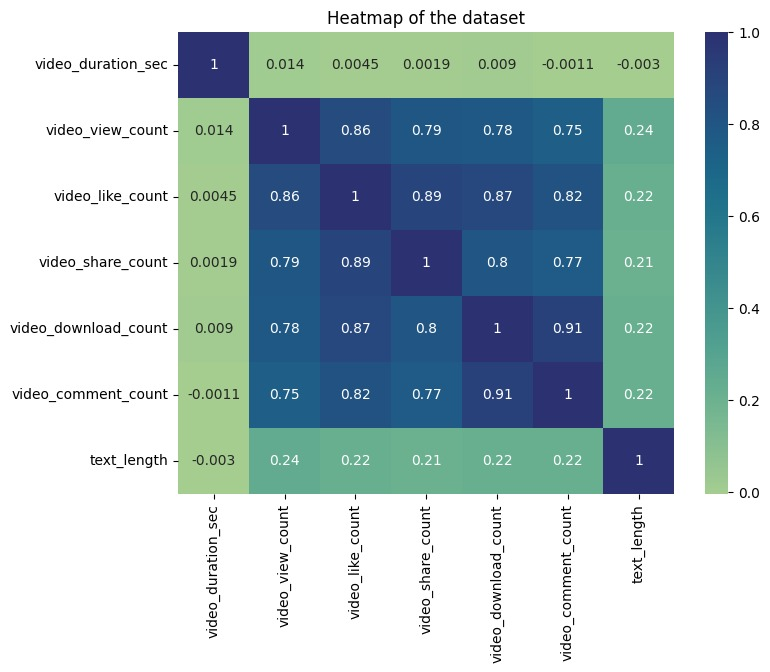

# 📊 Logistic Regression Classification: Verified Status Prediction

---

## 📌 Project Overview

This project develops a **Logistic Regression classification model** to predict whether an account is **verified** or **not verified** based on engagement metrics and textual features.

The objective is to analyze behavioral patterns and build an interpretable classification model that explains the probability of verification.

---

## 🎯 Business Objective

Verified accounts typically exhibit stronger engagement signals.  
This project aims to:

- Identify key predictors of verification
- Analyze engagement-based behavior
- Build and evaluate a classification model
- Interpret feature influence using Logistic Regression

---

## 📂 Dataset Description

### 🔢 Numerical Features
- `video_duration_sec`
- `video_view_count`
- `video_like_count`
- `video_share_count`

### 📝 Text Feature
- `video_transcription_text` (engineered into text length feature)

### 🎯 Target Variable
- `verified_status`
  - Verified
  - Not Verified

Total observations used for evaluation: **8,942**

---

## 🔎 Exploratory Data Analysis (EDA)

Performed:

- Missing value analysis
- Feature distribution visualization
- Correlation matrix analysis
- Class-wise feature comparison

### 📊 Correlation Heatmap



**Key Observation:**
- Strong positive correlation between `video_view_count` and `video_like_count`
- Engagement metrics are significantly related

---

## 🛠 Data Preprocessing

- Feature engineering (text length extraction)
- One-hot encoding (where applicable)
- Train-test split
- Multicollinearity review
- Feature scaling (if applied)

---

## 🤖 Model Development

### Model Used:
Logistic Regression (Scikit-learn)

### Target:
`verified_status`

---

## 📊 Model Evaluation

### 🔢 Classification Report

| Class         | Precision | Recall | F1-Score | Support |
|--------------|-----------|--------|----------|----------|
| Verified     | 0.74      | 0.53   | 0.61     | 4459     |
| Not Verified | 0.63      | 0.81   | 0.71     | 4483     |

### 📈 Overall Performance

- **Accuracy:** 67%
- **Macro Avg F1-Score:** 0.66
- **Weighted Avg F1-Score:** 0.66

---

## 📉 Confusion Matrix

[[2346 2113]
[ 838 3645]]


### 📊 Confusion Matrix Visualization


### Interpretation:

- 2,346 verified accounts correctly classified
- 3,645 not verified accounts correctly classified
- Model performs better at identifying **not verified accounts** (Recall = 0.81)
- Moderate difficulty detecting verified accounts (Recall = 0.53)

---

---

## 🔍 Key Insights

- Engagement metrics significantly influence verification prediction.
- Model favors identifying "not verified" accounts.
- Higher recall for not verified class indicates strong negative-class detection.
- Logistic regression provides interpretable coefficients for business explanation.

---

## ⚖️ Model Strengths & Limitations

### ✅ Strengths
- Balanced dataset
- Interpretable model
- Reasonable classification accuracy
- Strong recall for non-verified accounts

### ⚠️ Limitations
- Moderate recall for verified class
- Potential multicollinearity among engagement features
- Could benefit from hyperparameter tuning

---

## 🚀 Future Improvements

- Apply Cross-Validation
- Hyperparameter tuning
- Try Random Forest / XGBoost
- Perform feature selection
- Address class imbalance (if needed)
- Deploy using Flask or Streamlit

---

## 🧰 Technologies Used

- Python
- Pandas
- NumPy
- Scikit-learn
- Matplotlib
- Seaborn
- Jupyter Notebook

---

## ▶️ How to Run This Project

### Clone Repository
```bash
git clone https://github.com/yourusername/logistic-regression-verified-status-prediction.git

pip install -r requirements.txt

jupyter notebook Logistic_Regression.ipynb
